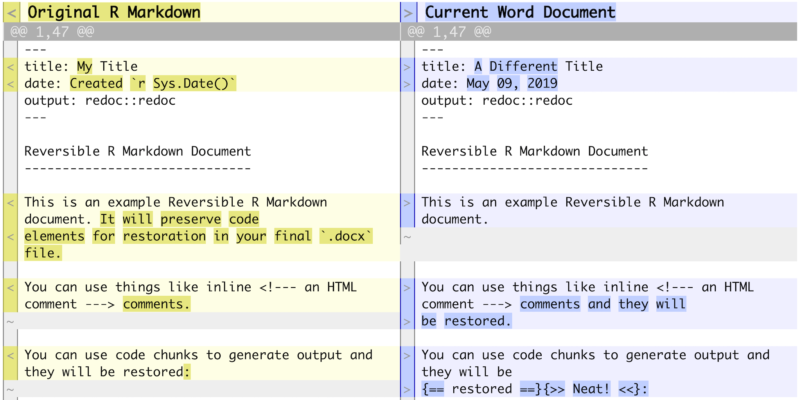
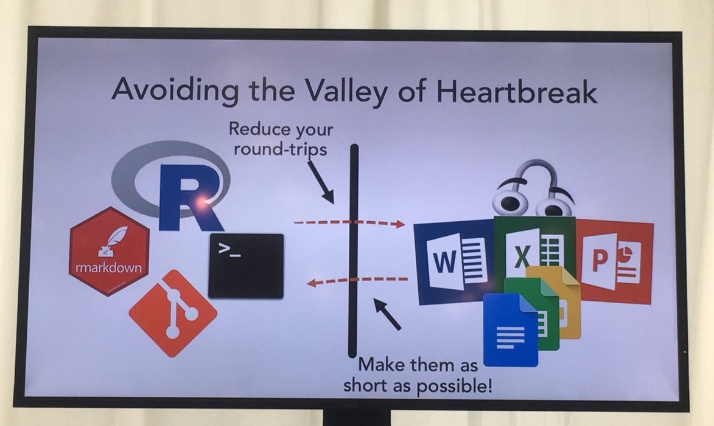

```{r setup, include=FALSE}
knitr::opts_chunk$set(echo = TRUE, message=F, warning=F)
```

A few weeks ago I attended the [New York R Conference](https://www.rstats.nyc/). There were 24 speakers, including our very own Elizabeth! Each person did a 20-minute presentation on some way they use R for their work and/or hobbies. There was a *ton* of information, but not all of it directly useful for our workflow as statistical consultants in an academic setting.

Videos of the talks should be out any day now (I had hoped they'd be out by today!) but I've put together some the topics/packages/functions I found most intriguing or useful.

# Visualizing data

Use `naniar::vis_miss` to visualize your missing data quickly. Returns a ggplot object so you can edit titles, colors, etc. if necessary. 

```{r}
library(tidyverse)
library(naniar)
vis_miss(airquality) # a base R data set
vis_miss(airquality, cluster=T) + labs(title="Missingness in the airquality data set")
```

# `daff`

A neat package for checking if and where differences in two data sets are occurring.

```{r}
library(daff)
dat1 <- data.frame(A = c(1:3), B = c(T,F,T))
dat2 <- data.frame(A = c(1:4), C = c("apple",NA,NA,"banana"))
diff_data(dat1, dat2)
```

I thought this would be useful for when you receive new data sets from investigators and want to make sure column names, patients, etc. haven't changed. Check out the full documentation [here](https://github.com/edwindj/daff).

# Gohelverse

Noam Ross shared code for editable figures using David Gohel's `officer` and `rvg` packages. I've shared code for this before on our #r_stats slack channel after I saw him present it at an R-Ladies event in the fall, but [in case you missed it](https://github.com/hoffmakl/reporting/blob/master/vg.R).

```{r}
library(rvg)
library(officer)

#sample data
dat <- data.frame(x = rnorm(100, 10),
                  y = rnorm(100, 100),
                  z = rnorm(100, 1))

#make an empty ppt
read_pptx() %>% 
  #add a slide, must specify the slide layout and layout name
  add_slide(layout="Title and Content", master="Office Theme") %>%
  #specify what you want on the slide (code = ...)
  #type="body" means the plots going in the body part of the layout
  #width and height are in inches
  ph_with_vg(code = plot(dat$x, dat$y, main="Edit me!", pch=16), type="body", width=6, height=4) %>%
  #output your ppt (target argument is just the file destination/name)
  print(target="plot.pptx")
```

# `redoc`

Noam Ross also shared his new package, `redoc`, which allows you to reload an Rmd-generated word file back into R as a modified Rmd file.

```{r}
#remotes::install_github("noamross/redoc")
```




This is part of his goal to decrease the pain of "the valley of heartbreak." 


# Pipelines in `drake`


This could definitely be an entire computing club presentation... but for long projects that you have to redo with new data often, `drake` is becoming really popular. Amanda Dobbyn gave an awesome presentation and you can see her slides [here](https://aedobbyn.github.io/nyr-2019/#1).

Another super informative bookdown guide by the authors can be found [here](https://ropenscilabs.github.io/drake-manual/).
Essentially their motto is "what gets done stays done" so that you are not redoing work you've already done in order to update your results. Yet, you're still redoing what needs to be done in a reproducible way!


# Git merge conflicts

I went to a whole-day workshop on Git so if you're interested in talking more about this let me know. *BUT* the biggest thing I learned was that if you are ever using Git and find your code has strange characters like >>>>>>>> HEAD followed by ======== and a long set of letters/numbers, this means you have a merge conflict. It's meant to be a flag so you know where to fix the differences in your two files you're trying to version control! I spent days struggling with this problem before, so I thought I'd pass the message along in case anyone runs into it someday. :)

# Talks to check out

When the talks are released, I'll make a post on slack, and when they are, I highly recommend:

- Emily Robinson's description of how to make a package with `usethis`

- Jaqueline Nolis' **really funny** talk on how neural nets aren't actually hard at all

- Andrew Gelman's discussion on "solving all your statistical problems with p-values"

# A bonus!

This was not from the New York R Conference but I saw it on [twitter](https://twitter.com/OppenheimerEvan/status/1132092898760114184) while making these slides and I just love it so much...

```{r}
#install.packages("genius")
library(genius)
genius_lyrics("the beatles", "hey jude")
```

# Takeaways

- You can check out tweets from the conference by searching the hashtag #rstatsnyc

- You can find R-Ladies NYC meetups [here](https://www.meetup.com/rladies-newyork/)

- And you can find the New York R meetups [here](https://www.meetup.com/nyhackr/)

